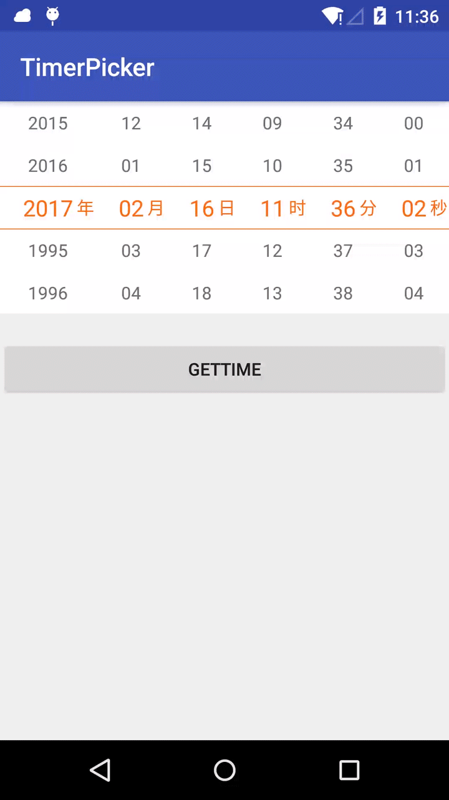

# TimerPicker

**说明：**

仿小米时间选择器，选中项有个颜色大小的过度动画；  
Demo 中 NumberPickerView 的更多说明：[Carbs0126/NumberPickerView](https://github.com/Carbs0126/NumberPickerView)

效果图：

**使用说明：**

调用下面方法添加 View 到你要显示位置的父控件内  
若只想显示 “年月日” 则在“时分秒”对应的参数传入 -1 即可

	private View getTimePickerView() {
        View timepickerview = View.inflate(this, R.layout.timepicker, null);
        timerPickerView = new TimerPickerView(timepickerview);
        // 获取当前时间
        Calendar calendar = Calendar.getInstance();
        int year = calendar.get(Calendar.YEAR);
        int month = calendar.get(Calendar.MONTH)+1;
        int day = calendar.get(Calendar.DAY_OF_MONTH);
        int hour = calendar.get(Calendar.HOUR_OF_DAY);
        int min = calendar.get(Calendar.MINUTE);
        int second = calendar.get(Calendar.SECOND);
        timerPickerView.setSTART_YEAR(1995);// 设置最小年份
        timerPickerView.setEND_YEAR(year);// 设置最大年份
        timerPickerView.initDateTimePicker(year, month, day, hour, min,second);//传入-1则不显示该列
        return timepickerview;
    }